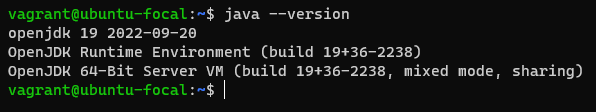

# From Fresh install to Dependency-Track server

The server will be running on `Ubuntu 20.04.6 LTS`, with the **minimum requirements** from the Dependency-Track's official documentation.

# Installations

## Java OpenJDK

Java is needed in order to run `.jar` executable files provided by the [Dependency-Track's Github](https://github.com/DependencyTrack). 

We're about to install `openjdk-19-jre`.

> Both packages `openjdk-xx-jdk` and `openjdk-xx-jre` can build and run java files. The difference is `jdk` is for development therefore heavier than `jre`, which the runtime environment only. We will chose smaller installation and only what we need on this server.

Two methods can be used:

1. Install from APT repositories (if available).
   > You can also search for a specific version of (> `openjdk-17-xxx`)  and then install it with:

   ```shell
   $ sudo apt install openjdk-19-jre
   ```
2. Install manually, which include few more steps:
   - Make sure you have `wget` installed on your system, by default it should be.
   - Copy the link of the archive that meets your needs on <https://jdk.java.net/archive/>.
   - Download the file you want with `wget url_of_openjdk_archive`.
      ```shell
      $ wget https://download.java.net/java/GA/jdk19/877d6127e982470ba2a7faa31cc93d04/36/GPL/openjdk-19_linux-x64_bin.tar.gz
      ```
   - Extract the archive content with `tar xvf tarball`.
      ```shell
      $ tar xvf openjdk-19_linux-x64_bin.tar.gz
      $ rm openjdk-19_linux-x64_bin.tar.gz
      ```
   - Then move the extracted folder at `/opt/extracted_folder/`.
      ```shell
      $ sudo mv jdk-19/ /opt/jdk-19/
      ```
   - Set the environment variables.
     ```shell
     $ echo 'export JAVA_HOME=/opt/jdk-19' | sudo tee /etc/profile.d/java-19.sh
     $ echo 'export PATH=$JAVA_HOME/bin:$PATH'|sudo tee -a /etc/profile.d/java-19.sh
     $ source /etc/profile.d/java-19.sh
     ```

Before moving on we can verify that we have Java correctly installed on our server:
```shell
$ java --version
```


## Nginx
For a quick installation of `nginx` we can use the `apt` package manager:
```shell
$ sudo apt install nginx -y
```
Create a new `nginx` configuration file for the Dependency-Track server:
```shell
$ sudo vim /etc/nginx/sites-available/dtrack.conf
```
Then add the following content:
```ini
upstream dtrack-backend {
  server 127.0.0.1:8080;
}

server {
  listen      80;
  server_name _;

  access_log /var/log/nginx/dtrack-access.log;
  error_log /var/log/nginx/dtrack-error.log debug;

  location / {
    root      /opt/owasp/dependency-track-frontend;
    index     index.html;
    try_files $uri $uri/ /index.html;
  }

  location /api {
        include proxy_params;
        proxy_pass http://dtrack-backend;
    }

  error_page 500 502 503 504 /50x.html;

  location = /50x.html {
    root /usr/share/nginx/html;
  }
}
```

Notice that the `nginx` server is listneing on port `80` and the `dtrack-backend` is listening on port `8080`.

Then we need to remove the `default` symbolic link and create a new one to the `dtrack.conf` we just created:
```shell
$ cd /etc/nginx/sites-enabled/
$ sudo rm default
$ sudo ln -s /etc/nginx/sites-available/dtrack.conf dtrack
```

After what we have to verify that the configuration file doesn't contain any syntax error, and restart if everything is fine:
```shell
$ sudo nginx -t
$ sudo systemctl restart nginx
```

## Dependency-Track
Before going further, we need the `unzip` and `wget` packages, which _if you don't have_ you can install via `apt`.

Next we will create a specific user for the Dependency-Track server. This user will be used to run the server and will not have any privilege on the system.

Create a folder for the future dtrack user:
```shell	
$ sudo mkdir /opt/owasp
```
Create the dtrack group, and the user with no login, shell and no home directory:
```shell
$ sudo groupadd dtrack
$ sudo useradd -M -s /bin/false -g dtrack -d /opt/owasp dtrack
```
Next we will download the latest version of the Dependency-Track server from the [official Github](https://github.com/DependencyTrack/)

> Remember to always download the the same version of the frontend and backend to avoid any compatibility issues.
> At the time of writing this document, the latest version for frontend and backend is `4.8.1`.

Frontend:
```shell
$ sudo mkdir /opt/owasp/dependency-track-frontend
$ cd /opt/owasp/dependency-track-frontend
$ sudo wget https://github.com/DependencyTrack/frontend/releases/download/4.8.1/frontend-dist.zip
$ sudo unzip frontend-dist.zip
$ sudo mv dist/* .
$ sudo rm -rf dist frontend-dist.zip
```

Backend:
```shell
$ sudo mkdir /opt/owasp/dependency-track-backend
$ cd /opt/owasp/dependency-track-backend
$ sudo wget https://github.com/DependencyTrack/dependency-track/releases/download/4.8.1/dependency-track-apiserver.jar
```
Change the owner of the `owasp` folder to the `dtrack` user:
```shell
$ sudo chown -R dtrack:dtrack /opt/owasp
```

### Dependency-Track Service

Now we can create a service file for the Dependency-Track server:
```shell
$ sudo vim /etc/systemd/system/dtrack.service
```
I have already made the configuration file, so you can just copy and paste the following content:
```ini
[Unit]
Description = Dependency Track server service
After = network.target
StartLimitIntervalSec = 0

[Service]
Type = simple
Restart = always
RestartSec = 1
User = dtrack
Group = dtrack
ExecStart = /opt/jdk-19/bin/java -Xmx4G -jar /opt/owasp/dependency-track-backend/dependency-track-apiserver.jar

[Install]
WantedBy = multi-user.target
```

Then we need to reload the `systemd` daemon, restart `nginx`, and start the `dtrack` service:
```shell
$ sudo systemctl daemon-reload
$ sudo systemctl restart nginx
$ sudo systemctl start dtrack
```


## PostgreSQL

> PostgreSQL is a powerful, open source object-relational database system with over 35 years of active development that has earned it a strong reputation for reliability, feature robustness, and performance. - _Source: [postgresql](https://postgresql.org)_

### Installation

To install the latest version we need to add the apt repository to our system source lists, it's simple.

- First we have to create the file repository configuration:
   ```shell
   $ sudo sh -c 'echo "deb http://apt.postgresql.org/pub/repos/apt $(lsb_release -cs)-pgdg main" > /etc/apt/sources.list.d/pgdg.list'
   ```
- Then we'll import the signing key:
  ```shell
  $ wget --quiet -O - https://www.postgresql.org/media/keys/ACCC4CF8.asc | sudo apt-key add -
  ```
- Update the package lists:
   ```shell
   $ sudo apt update
   ```
- Install the latest version of `postgresql`:
   ```shell
   $ sudo apt install postgresql
   ```
- Check if the software is correctly isntalled:
   ```shell
   $ postgres -V
   ```

<details><summary>In case of Command not found error</summary>
After follonging the steps above, if you get the following error:

```shell
$ postgres -V
Command 'postgres' not found, but can be installed with: [...]
```
It means that the `postgresql` package is not in your `$PATH` environment variable. To fix this, we need to add the `postgresql` binary path to the `$PATH` variable.

Try sourcing the `.profile` file before going down the rabbit hole:
```shell
$ source .profile
```
This may resolve the problem, in case it didn't follow the steps below.

To do so, we need to find the path of the `postgresql` binary file. It should be in `/usr/lib/postgresql/xx/bin/` where `xx` is the version of `postgresql` installed on your system (Mind looking at [the latest release](https://github.com/postgres/postgres/tags) if needed).

We can find the version of `postgresql` installed on our system with the following command:
```shell
$ /usr/lib/postgresql/xx/bin/postgres -V
```

Then we can create a link to the binary file in `/usr/bin/`:
```shell
$ sudo ln -s /usr/lib/postgresql/xx/bin/postgres /usr/bin/postgres
```

Finally we can check again if the `postgres` command is now available:
```shell
$ postgres -V
postgres (PostgreSQL) xx.x [...]
```

</details>
   
Then we will need to change the `postgres` user password in order to log in as it:
```shell
$ sudo passwd postgres
```

### Configuration
Interact with the database server using the `psql` command:
```shell
$ sudo -iu postgres
$ psql
```
You should have enter the `psql` shell and we can create the `dtrackuser` database user:
```SQL
CREATE USER dtrackuser;
ALTER USER dtrackuser WITH ENCRYPTED PASSWORD 'gc1lstv019kM6wF';
```
Then we can create the `dtrackdb` database and give privileges to the `dtrackuser` user:
```SQL
CREATE DATABASE dtrackdb OWNER dtrackuser;
GRANT ALL PRIVILEGES ON DATABASE dtrackdb TO dtrackuser;
```
Exit the `psql` shell:
```SQL
\q
```

### Dependency-Track database reconfiguration
Next we need to configure the Dependency-Track server to use `postgresql` with the `dtrackdb` database and the `dtrackuser` user. Before mofiying the configuration file, we need to stop the `dtrack` service, if it's running.

To do so, we need to cerate the `application.properties` file in `/opt/owasp/.dependency-track/`:
```shell
$ cd /opt/owasp/.dependency-track/
$ sudo vim application.properties
```
Copy and paste the following default configuration from the [Dependency-Track documentation](https://docs.dependencytrack.org/getting-started/database-support/#examples) :
<details><summary>Default Dependency-Track Alpine Configuration</summary>

```ini
############################ Alpine Configuration ###########################

# Required
# Defines the number of worker threads that the event subsystem will consume.
# Events occur asynchronously and are processed by the Event subsystem. This
# value should be large enough to handle most production situations without
# introducing much delay, yet small enough not to pose additional load on an
# already resource-constrained server.
# A value of 0 will instruct Alpine to allocate 1 thread per CPU core. This
# can further be tweaked using the alpine.worker.thread.multiplier property.
# Default value is 0.
alpine.worker.threads=0

# Required
# Defines a multiplier that is used to calculate the number of threads used
# by the event subsystem. This property is only used when alpine.worker.threads
# is set to 0. A machine with 4 cores and a multiplier of 4, will use (at most)
# 16 worker threads. Default value is 4.
alpine.worker.thread.multiplier=4

# Required
# Defines the path to the data directory. This directory will hold logs, keys,
# and any database or index files along with application-specific files or 
# directories.
alpine.data.directory=~/.dependency-track

# Optional
# Defines the path to the secret key to be used for data encryption and decryption.
# The key will be generated upon first startup if it does not exist.
# Default is "<alpine.data.directory>/keys/secret.key".
# alpine.secret.key.path=/var/run/secrets/secret.key

# Required
# Defines the interval (in seconds) to log general heath information. If value
# equals 0, watchdog logging will be disabled.
alpine.watchdog.logging.interval=0

# Required
# Defines the database mode of operation. Valid choices are:
# 'server', 'embedded', and 'external'.
# In server mode, the database will listen for connections from remote hosts.
# In embedded mode, the system will be more secure and slightly faster. 
# External mode should be used when utilizing an external database server 
# (i.e. mysql, postgresql, etc).
alpine.database.mode=embedded

# Optional
# Defines the TCP port to use when the database.mode is set to 'server'.
alpine.database.port=9092

# Required
# Specifies the JDBC URL to use when connecting to the database.
alpine.database.url=jdbc:h2:~/.dependency-track/db

# Required
# Specifies the JDBC driver class to use.
alpine.database.driver=org.h2.Driver

# Optional
# Specifies the username to use when authenticating to the database.
alpine.database.username=sa

# Optional
# Specifies the password to use when authenticating to the database.
# alpine.database.password=

# Optional
# Specifies if the database connection pool is enabled.
alpine.database.pool.enabled=true

# Optional
# This property controls the maximum size that the pool is allowed to reach,
# including both idle and in-use connections.
# The property can be set globally for both transactional and non-transactional
# connection pools, or for each pool type separately. When both global and pool-specific
# properties are set, the pool-specific properties take precedence.
alpine.database.pool.max.size=20
# alpine.database.pool.tx.max.size=
# alpine.database.pool.nontx.max.size=

# Optional
# This property controls the minimum number of idle connections in the pool.
# This value should be equal to or less than alpine.database.pool.max.size.
# Warning: If the value is less than alpine.database.pool.max.size,
# alpine.database.pool.idle.timeout will have no effect.
# The property can be set globally for both transactional and non-transactional
# connection pools, or for each pool type separately. When both global and pool-specific
# properties are set, the pool-specific properties take precedence.
alpine.database.pool.min.idle=10
# alpine.database.pool.tx.min.idle=
# alpine.database.pool.nontx.min.idle=

# Optional
# This property controls the maximum amount of time that a connection is
# allowed to sit idle in the pool.
# The property can be set globally for both transactional and non-transactional
# connection pools, or for each pool type separately. When both global and pool-specific
# properties are set, the pool-specific properties take precedence.
alpine.database.pool.idle.timeout=300000
# alpine.database.pool.tx.idle.timeout=
# alpine.database.pool.nontx.idle.timeout=

# Optional
# This property controls the maximum lifetime of a connection in the pool.
# An in-use connection will never be retired, only when it is closed will
# it then be removed.
# The property can be set globally for both transactional and non-transactional
# connection pools, or for each pool type separately. When both global and pool-specific
# properties are set, the pool-specific properties take precedence.
alpine.database.pool.max.lifetime=600000
# alpine.database.pool.tx.max.lifetime=
# alpine.database.pool.nontx.max.lifetime=

# Optional
# When authentication is enforced, API keys are required for automation, and
# the user interface will prevent anonymous access by prompting for login
# credentials.
alpine.enforce.authentication=true

# Optional
# When authorization is enforced, team membership for both API keys and user
# accounts are restricted to what the team itself has access to. To enforce 
# authorization, the enforce.authentication property (above) must be true.
alpine.enforce.authorization=true

# Required
# Specifies the number of bcrypt rounds to use when hashing a users password.
# The higher the number the more secure the password, at the expense of
# hardware resources and additional time to generate the hash.
alpine.bcrypt.rounds=14

# Required
# Defines if LDAP will be used for user authentication. If enabled,
# alpine.ldap.* properties should be set accordingly.
alpine.ldap.enabled=false

# Optional
# Specifies the LDAP server URL
# Example (Microsoft Active Directory):
#    alpine.ldap.server.url=ldap://ldap.example.com:3268
#    alpine.ldap.server.url=ldaps://ldap.example.com:3269
# Example (ApacheDS, Fedora 389 Directory, NetIQ/Novell eDirectory, etc):
#    alpine.ldap.server.url=ldap://ldap.example.com:389
#    alpine.ldap.server.url=ldaps://ldap.example.com:636
alpine.ldap.server.url=ldap://ldap.example.com:389

# Optional
# Specifies the base DN that all queries should search from
alpine.ldap.basedn=dc=example,dc=com

# Optional
# Specifies the LDAP security authentication level to use. Its value is one of
# the following strings: "none", "simple", "strong". If this property is empty
# or unspecified, the behaviour is determined by the service provider.
alpine.ldap.security.auth=simple

# Optional
# If anonymous access is not permitted, specify a username with limited access
# to the directory, just enough to perform searches. This should be the fully
# qualified DN of the user.
alpine.ldap.bind.username=

# Optional
# If anonymous access is not permitted, specify a password for the username
# used to bind.
alpine.ldap.bind.password=

# Optional
# Specifies if the username entered during login needs to be formatted prior
# to asserting credentials against the directory. For Active Directory, the
# userPrincipal attribute typically ends with the domain, whereas the
# samAccountName attribute and other directory server implementations do not.
# The %s variable will be substitued with the username asserted during login.
# Example (Microsoft Active Directory):
#    alpine.ldap.auth.username.format=%s@example.com
# Example (ApacheDS, Fedora 389 Directory, NetIQ/Novell eDirectory, etc):
#    alpine.ldap.auth.username.format=%s
alpine.ldap.auth.username.format=%s@example.com

# Optional
# Specifies the Attribute that identifies a users ID
# Example (Microsoft Active Directory):
#    alpine.ldap.attribute.name=userPrincipalName
# Example (ApacheDS, Fedora 389 Directory, NetIQ/Novell eDirectory, etc):
#    alpine.ldap.attribute.name=uid
alpine.ldap.attribute.name=userPrincipalName

# Optional
# Specifies the LDAP attribute used to store a users email address
alpine.ldap.attribute.mail=mail

# Optional
# Specifies the LDAP search filter used to retrieve all groups from the
# directory.
# Example (Microsoft Active Directory):
#    alpine.ldap.groups.filter=(&(objectClass=group)(objectCategory=Group))
# Example (ApacheDS, Fedora 389 Directory, NetIQ/Novell eDirectory, etc):
#    alpine.ldap.groups.filter=(&(objectClass=groupOfUniqueNames))
alpine.ldap.groups.filter=(&(objectClass=group)(objectCategory=Group))

# Optional
# Specifies the LDAP search filter to use to query a user and retrieve a list
# of groups the user is a member of. The {USER_DN} variable will be substituted
# with the actual value of the users DN at runtime.
# Example (Microsoft Active Directory):
#    alpine.ldap.user.groups.filter=(&(objectClass=group)(objectCategory=Group)(member={USER_DN}))
# Example (Microsoft Active Directory - with nested group support):
#    alpine.ldap.user.groups.filter=(member:1.2.840.113556.1.4.1941:={USER_DN})
# Example (ApacheDS, Fedora 389 Directory, NetIQ/Novell eDirectory, etc):
#    alpine.ldap.user.groups.filter=(&(objectClass=groupOfUniqueNames)(uniqueMember={USER_DN}))
alpine.ldap.user.groups.filter=(member:1.2.840.113556.1.4.1941:={USER_DN})

# Optional
# Specifies the LDAP search filter used to search for groups by their name.
# The {SEARCH_TERM} variable will be substituted at runtime.
# Example (Microsoft Active Directory):
#    alpine.ldap.groups.search.filter=(&(objectClass=group)(objectCategory=Group)(cn=*{SEARCH_TERM}*))
# Example (ApacheDS, Fedora 389 Directory, NetIQ/Novell eDirectory, etc):
#    alpine.ldap.groups.search.filter=(&(objectClass=groupOfUniqueNames)(cn=*{SEARCH_TERM}*))
alpine.ldap.groups.search.filter=(&(objectClass=group)(objectCategory=Group)(cn=*{SEARCH_TERM}*))

# Optional
# Specifies the LDAP search filter used to search for users by their name.
# The {SEARCH_TERM} variable will be substituted at runtime.
# Example (Microsoft Active Directory):
#    alpine.ldap.users.search.filter=(&(objectClass=group)(objectCategory=Group)(cn=*{SEARCH_TERM}*))
# Example (ApacheDS, Fedora 389 Directory, NetIQ/Novell eDirectory, etc):
#    alpine.ldap.users.search.filter=(&(objectClass=inetOrgPerson)(cn=*{SEARCH_TERM}*))
alpine.ldap.users.search.filter=(&(objectClass=user)(objectCategory=Person)(cn=*{SEARCH_TERM}*))

# Optional
# Specifies if mapped LDAP accounts are automatically created upon successful
# authentication. When a user logs in with valid credentials but an account has
# not been previously provisioned, an authentication failure will be returned.
# This allows admins to control specifically which ldap users can access the
# system and which users cannot. When this value is set to true, a local ldap
# user will be created and mapped to the ldap account automatically. This
# automatic provisioning only affects authentication, not authorization.
alpine.ldap.user.provisioning=false

# Optional
# This option will ensure that team memberships for LDAP users are dynamic and
# synchronized with membership of LDAP groups. When a team is mapped to an LDAP
# group, all local LDAP users will automatically be assigned to the team if
# they are a member of the group the team is mapped to. If the user is later
# removed from the LDAP group, they will also be removed from the team. This
# option provides the ability to dynamically control user permissions via an
# external directory.
alpine.ldap.team.synchronization=false

# Optional
# HTTP proxy. If the address is set, then the port must be set too.
# alpine.http.proxy.address=proxy.example.com
# alpine.http.proxy.port=8888
# alpine.http.proxy.username=
# alpine.http.proxy.password=
# alpine.no.proxy=localhost,127.0.0.1

# Optional 
# HTTP Outbound Connection Timeout Settings. All values are in seconds.
# alpine.http.timeout.connection=30
# alpine.http.timeout.socket=30
# alpine.http.timeout.pool=60
    
# Optional
# Cross-Origin Resource Sharing (CORS) headers to include in REST responses.
# If 'alpine.cors.enabled' is true, CORS headers will be sent, if false, no
# CORS headers will be sent.
# See Also: https://developer.mozilla.org/en-US/docs/Web/HTTP/CORS
# The following are default values
#alpine.cors.enabled=true
#alpine.cors.allow.origin=*
#alpine.cors.allow.methods=GET, POST, PUT, DELETE, OPTIONS
#alpine.cors.allow.headers=Origin, Content-Type, Authorization, X-Requested-With, Content-Length, Accept, Origin, X-Api-Key, X-Total-Count, *
#alpine.cors.expose.headers=Origin, Content-Type, Authorization, X-Requested-With, Content-Length, Accept, Origin, X-Api-Key, X-Total-Count
#alpine.cors.allow.credentials=true
#alpine.cors.max.age=3600

# Optional
# Defines whether Prometheus metrics will be exposed.
# If enabled, metrics will be available via the /metrics endpoint.
alpine.metrics.enabled=false

# Optional
# Defines the username required to access metrics.
# Has no effect when alpine.metrics.auth.password is not set.
alpine.metrics.auth.username=

# Optional
# Defines the password required to access metrics.
# Has no effect when alpine.metrics.auth.username is not set.
alpine.metrics.auth.password=

# Required
# Defines if OpenID Connect will be used for user authentication.
# If enabled, alpine.oidc.* properties should be set accordingly.
alpine.oidc.enabled=false

# Optional
# Defines the client ID to be used for OpenID Connect.
# The client ID should be the same as the one configured for the frontend,
# and will only be used to validate ID tokens.
alpine.oidc.client.id=

# Optional
# Defines the issuer URL to be used for OpenID Connect.
# This issuer MUST support provider configuration via the /.well-known/openid-configuration endpoint.
# See also:
# - https://openid.net/specs/openid-connect-discovery-1_0.html#ProviderMetadata
# - https://openid.net/specs/openid-connect-discovery-1_0.html#ProviderConfig
alpine.oidc.issuer=

# Optional
# Defines the name of the claim that contains the username in the provider's userinfo endpoint.
# Common claims are "name", "username", "preferred_username" or "nickname".
# See also: https://openid.net/specs/openid-connect-core-1_0.html#UserInfoResponse
alpine.oidc.username.claim=name

# Optional
# Specifies if mapped OpenID Connect accounts are automatically created upon successful
# authentication. When a user logs in with a valid access token but an account has
# not been previously provisioned, an authentication failure will be returned.
# This allows admins to control specifically which OpenID Connect users can access the
# system and which users cannot. When this value is set to true, a local OpenID Connect
# user will be created and mapped to the OpenID Connect account automatically. This
# automatic provisioning only affects authentication, not authorization.
alpine.oidc.user.provisioning=false

# Optional
# This option will ensure that team memberships for OpenID Connect users are dynamic and
# synchronized with membership of OpenID Connect groups or assigned roles. When a team is
# mapped to an OpenID Connect group, all local OpenID Connect users will automatically be
# assigned to the team if they are a member of the group the team is mapped to. If the user
# is later removed from the OpenID Connect group, they will also be removed from the team. This
# option provides the ability to dynamically control user permissions via the identity provider.
# Note that team synchronization is only performed during user provisioning and after successful
# authentication.
alpine.oidc.team.synchronization=false

# Optional
# Defines the name of the claim that contains group memberships or role assignments in the provider's userinfo endpoint.
# The claim must be an array of strings. Most public identity providers do not support group or role management.
# When using a customizable / on-demand hosted identity provider, name, content, and inclusion in the userinfo endpoint
# will most likely need to be configured.
alpine.oidc.teams.claim=groups

# Optional
# Defines the size of the thread pool used to perform requests to the Snyk API in parallel.
# The thread pool will only be used when Snyk integration is enabled.
# A high number may result in quicker exceeding of API rate limits,
# while a number that is too low may result in vulnerability analyses taking longer.
snyk.thread.pool.size=10

# Optional
# Defines the maximum amount of retries to perform for each request to the Snyk API.
# Retries are performed with increasing delays between attempts using an exponential backoff strategy.
# The initial duration defined in snyk.retry.exponential.backoff.initial.duration.seconds will be
# multiplied with the value defined in snyk.retry.exponential.backoff.multiplier after each retry attempt,
# until the maximum duration defined in snyk.retry.exponential.backoff.max.duration.seconds is reached.
snyk.retry.max.attempts=6

# Optional
# Defines the multiplier for the exponential backoff retry strategy.
snyk.retry.exponential.backoff.multiplier=2

# Optional
# Defines the duration in seconds to wait before attempting the first retry.
snyk.retry.exponential.backoff.initial.duration.seconds=1

# Optional
# Defines the maximum duration in seconds to wait before attempting the next retry.
snyk.retry.exponential.backoff.max.duration.seconds=60

# Optional
#Defines the maximum number of purl sent in a single request to OSS Index.
# The default value is 128.
ossindex.request.max.purl=128

# Optional
#Defines the maximum number of attempts used by Resilience4J for exponential backoff retry regarding OSSIndex calls.
# The default value is 50.
ossindex.retry.backoff.max.attempts=50

# Optional
#Defines the multiplier used by Resilience4J for exponential backoff retry regarding OSSIndex calls.
# The default value is 2.
ossindex.retry.backoff.multiplier=2

# Optional
#Defines the maximum duration used by Resilience4J for exponential backoff retry regarding OSSIndex calls. This value is in milliseconds
# The default value is 10 minutes.
ossindex.retry.backoff.max.duration=600000

# Optional
#This flag activate the cache stampede blocker for the repository meta analyzer allowing to handle high concurrency workloads when there
#is a high ratio of duplicate components which can cause unnecessary external calls and index violation on PUBLIC.REPOSITORY_META_COMPONENT_COMPOUND_IDX during cache population.
# The default value is false as enabling the cache stampede blocker can create useless locking if the portfolio does not have a high ratio of duplicate components.
repo.meta.analyzer.cacheStampedeBlocker.enabled=false

# Optional
#The cache stampede blocker uses a striped (partitioned) lock to distribute locks across keys.
#This parameter defines the number of buckets used by the striped lock. The lock used for a given key is derived from the key hashcode and number of buckets.
# The default value is 1000.
repo.meta.analyzer.cacheStampedeBlocker.lock.buckets=1000

# Optional
#Defines the maximum number of attempts used by Resilience4J for exponential backoff retry regarding repo meta analyzer cache loading per key.
# The default value is 10.
repo.meta.analyzer.cacheStampedeBlocker.max.attempts=10
```
</details>

Then change the following properties in the `application.properties` file to match the database configuration we just made:
```ini
alpine.database.mode=external
alpine.database.port=5432
alpine.database.url=jdbc:postgresql://localhost:5432/dtrackdb
alpine.database.driver=org.postgresql.Driver
alpine.database.username=dtrackuser
alpine.database.password=gc1lstv019kM6wF
```
And remember to change the owner of the `application.properties` file back to `dtrack:dtrack`:
```shell
$ sudo chown dtrack:dtrack application.properties
```

Then we need to reload the `systemd` daemon, restart `nginx`, and start the `dtrack` service:
```shell
$ sudo systemctl daemon-reload
$ sudo systemctl restart nginx
$ sudo systemctl start dtrack
```

After that you can go to the server's IP address in your browser and you should see the login page for Dependency-Track, using the default credentials `admin` and `admin` you can login and change the default password, Congratulations! You have successfully installed Dependency-Track on your server.