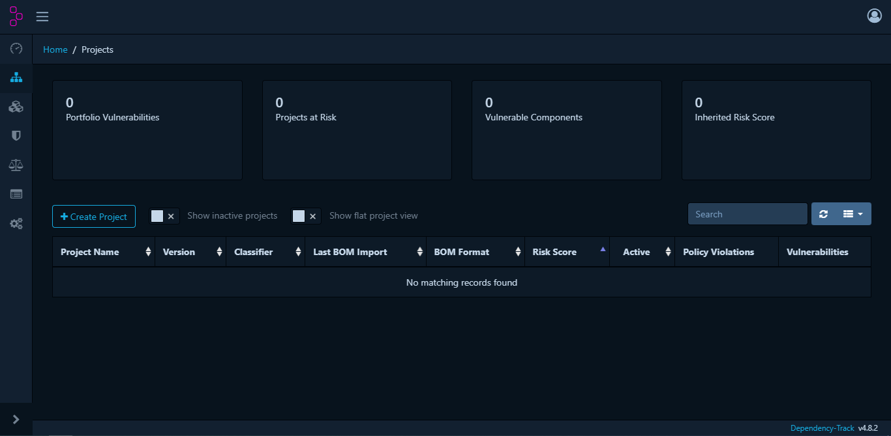
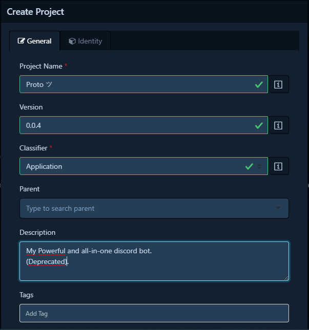

# Dependency-Track server usage
## First launch

Dependency-Track has a default account with `admin` / `admin` as credentials.

On the very first connection, you will be asked to change the password.

## Projects, Teams & Members
Like many administration tools, Dependency-Track is based on projects with unique identifier. A project is a collection of components and each projects can have multiples versions. 

Project Creation           |  Project UUID
:-------------------------:|:-------------------------:
  |  

A project can be linked to a team. A team is a collection of members. A member can be a user or a service account. Each teams can have different permissions over a project or an other.

When you're logged in as an admin, you can adminsitrate the server under the **Administration** tab.

Inside this section you will find the **Access Management** tab, where you will create your teams, members and permissions.

Projects, Teams and members are capable of heriting permissions and some settings from parents, this means that you can create a team for a specific project with a specific set of permissions for a specific group of people and manage them.

Creating a Team for a project is pretty straightforward. You can edit the team to add members and permissions to it.

In my exemple, I created a team for the project `Proto ツ`, and I created a `PROTO` team that has only `BOM_UPLOAD`, `VIEW_PORTFOLIO` & `VIEW_VULNERABILITY` as permissions. You can view the permissions and their description in the **Permissions** tab.

Then creating a new member `user-proto` and adding it to the `PROTO` team will give it the permissions of the team.